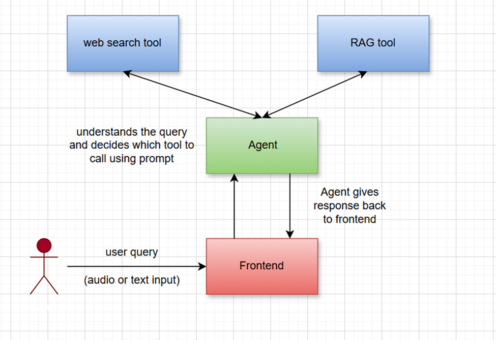

### Purpose

This system is a chatbot web application that allows users to interact with a language model via a user-friendly UI. It supports both text and voice input, and text-to-speech output for assistant replies.

### High-Level Architecture



### Components
**Frontend (React)**
* UI: Input field, mic button (Web Speech API), chat window, send button, text-to-speech buttons.
* Speech-to-Text: Uses webkitSpeechRecognition (Web Speech API).
* Text-to-Speech: Uses SpeechSynthesisUtterance.
* HTTP Client: Fetch API to call backend at POST /chat.

**Backend (FastAPI)**
* Endpoint: POST /chat — receives user text input.
* Orchestration Layer: Parses input, forwards to LLM, formats response.
* LLM Handler: Could be OpenAI, HuggingFace Transformers, or local model.
* Response: Sends JSON { "response": "..." } back to frontend.

### File Structure
```
project-root/
|
├── backend/
│   ├── main.py              # FastAPI server
│   └── orchestrator.py      # Logic to call LLM and format response
│
├── frontend/
│   └── src/
│       ├── App.jsx          # Main chatbot component (with mic and TTS)
│       └── main.jsx         # Entry point
│
├── README.md
├── requirements.txt file
├── image.png
└── system_design.md
```

### Technologies Used

* Frontend -> React, Web Speech API
* Backend -> FastAPI
* LLM -> Ollama model
* Speech-to-Text -> Web Speech API (browser-native)
* Text-to-Speech -> SpeechSynthesisUtterance

### Performance & Scalability

* Scalability -> Backend can be containerized and scaled behind a load balancer
* Latency -> LLM calls can be slow — consider caching frequent responses


